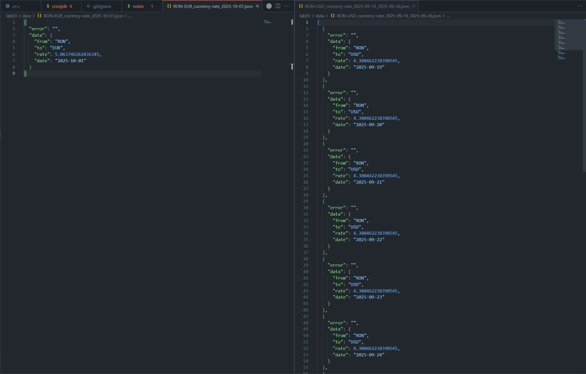

# Lab 03 – Cron Automation

## Цель работы
Автоматизировать запуск скрипта `currency_exchange_rate.py` по расписанию cron внутри контейнера и сохранить артефакты в общей директории. Решение продолжает лабораторную работу №2: Python-клиент тянет курсы валют из локального PHP API, упакованного во второй контейнер.

## Что понадобится
- Docker и плагин Docker Compose 2+
- Права на запуск контейнеров (Linux/macOS/WSL)

## Подготовка окружения
1. Скопируйте `lab03/.env.example` в `lab03/.env` и пропишите ключ API и URL сервиса. Значения по умолчанию направляют запросы на контейнер `php-api`.
2. Убедитесь, что каталоги `lab03/data` и `lab03/log` доступны для записи: в них будут появляться выгрузки и логи cron.

## Сборка и запуск
1. Из каталога `lab03/` соберите и поднимите стек:  
   ```bash
   docker compose up --build -d
   ```
2. Проверьте статус сервисов:  
   ```bash
   docker compose ps
   ```
3. PHP API будет доступен локально по адресу `http://localhost:8080/`.

Остановить контейнеры можно командой `docker compose down`. Для повторной чистой сборки сначала выполните `docker compose down`, затем `docker compose up --build -d` (см. заметки в файле `lab03/notes`).

## Cron-расписание
Запланированные задачи хранятся в `lab03/cronjob` и устанавливаются скриптом `entrypoint.sh` при старте контейнера `cron-runner`.

Текущее расписание в файле настроено на запуск обеих команд каждую минуту, чтобы упростить отладку:

```cron
* * * * * . /etc/environment; /usr/local/bin/python3 -m currency_exchange_rate.cli --api-url $EXCHANGE_API_BASE_URL --api-key $API_KEY --data-dir $DATA_DIR --log-dir $LOG_DIR RON EUR $(date -d "yesterday" +%Y-%m-%d) >> $LOG_DIR/cron.log 2>&1
* * * * * . /etc/environment; /usr/local/bin/python3 -m currency_exchange_rate.cli --range $(date -d "last friday -7 days" +%Y-%m-%d) $(date -d "last friday" +%Y-%m-%d) --api-url $EXCHANGE_API_BASE_URL --api-key $API_KEY --data-dir $DATA_DIR --log-dir $LOG_DIR RON USD >> $LOG_DIR/cron.log 2>&1
```

Но должно быть:
```cron
0 6 * * * 
0 17 * * 5 
```

Для соблюдения условий задания замените первую колонку cron на целевое расписание: ежедневный запуск в 06:00 и еженедельный запуск по пятницам в 17:00.

## Как проверить работу cron
- Просмотреть последние строки cron-лога внутри контейнера:  
  ```bash
  docker compose exec cron-runner tail -n 20 /var/log/cron.log
  ```
- Поскольку каталог `lab03/log` примонтирован в контейнер, тот же файл доступен на хосте: `tail -n 20 lab03/log/cron.log`.
- Проверить, что выгрузки валют появились в `lab03/data`:  
  ```bash
  docker compose exec cron-runner ls -1 /app/data
  ```
- При необходимости посмотреть логи PHP API: `docker compose logs php-api`.
- Результат теста:


## Структура каталога `lab03`
- `dockerfile` — образ Python-контейнера с cron (Python 3.12, cron, зависимости пакета).
- `docker-compose.yaml` — определение сервисов `php-api` и `cron-runner`, монтирование директорий `data/` и `log/`.
- `.env`, `.env.example` — переменные окружения для обоих контейнеров (ключ API и базовый URL).
- `cronjob` — расписание cron с двумя задачами (дневная и недельная выгрузка курсов).
- `entrypoint.sh` — сценарий запуска: экспортирует окружение, устанавливает cron, создаёт лог и держит `cron` на переднем плане.
- `currency_exchange_rate/` — Python-пакет из ЛР2 с CLI (`currency_exchange_rate/cli.py`) и утилитами для запроса/сохранения данных.
- `data/` — результирующие JSON-файлы с курсами валют (примеры: `RON-EUR_currency-rate_2025-10-01.json`).
- `log/` — файлы логов cron и приложения (`cron.log`, `currency_exchange_rate.log`).
- `lab02prep/` — исходники PHP API из предыдущей лабораторной, которые обслуживают запросы Python-скрипта.
- `notes` — вспомогательные команды для перезапуска и шаблоны расписаний.
- `image.png` — скриншот полученных данных.

## Что сдавать
Опубликуйте содержимое каталога `lab03` в репозитории и приложите ссылку, согласно требованиям задания.
