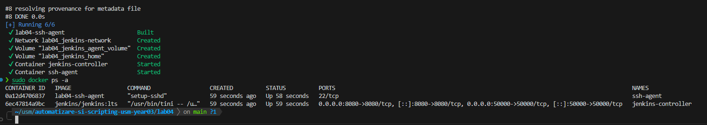
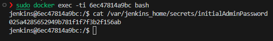

## Лабораторная работа №4 — Автоматизация DevOps-задач в Jenkins

### Цель
Настроить локальную инфраструктуру Jenkins на базе Docker, подключить удалённого SSH-агента с PHP-инструментами и собрать полноценный конвейер CI/CD для PHP‑проекта с установкой зависимостей и прогоном тестов.  


### Подготовка окружения
- Все файлы лабораторной собраны в каталоге `lab04/` репозитория.  
- На рабочей машине установлены Docker и Docker Compose.  
- Созданы SSH-ключи для агента и экспортированы через `.env`, пример значений фиксирован в `.env.example`.

### Инфраструктура Docker Compose
Основной стек описан в `docker-compose.yml`:
- `jenkins-controller` — образ `jenkins/jenkins:lts`, проброшены порты 8080/50000, данные сохраняются в `jenkins_home`.  
- `ssh-agent` — билд из локального `Dockerfile`, подключён к тому же мостовому `jenkins-network`, монтирует volume `jenkins_agent_volume` с рабочей директорией агента и получает публичный ключ из переменной `JENKINS_AGENT_SSH_PUBKEY`.  
- Определены общие тома `jenkins_home` и `jenkins_agent_volume`.

### Dockerfile для SSH-агента
Файл `Dockerfile` расширяет официальный `jenkins/ssh-agent`, устанавливая PHP CLI, расширение DOM (`php-xml`) и Composer:
```Dockerfile
FROM jenkins/ssh-agent

RUN apt update && apt install -y php php-xml php-cli composer
```
Этого набора достаточно, чтобы конвейер мог выполнять `composer install` и `vendor/bin/phpunit`. После сборки выполняется `docker-compose up -d`, что видно на скриншоте.  


### Настройка Jenkins Controller
1. Запущен контейнер `jenkins-controller` и получен первичный пароль (`docker-compose logs -f jenkins-controller` / `initialAdminPassword`).
2. Через браузер (http://localhost:8080) выполнена первоначальная настройка: установлены рекомендованные плагины, создан администратор.
3. Установлен и активирован плагин **SSH Agents Plugin**.

### Настройка SSH-агента
1. В каталоге `secrets/` сгенерированы ключи:
   ```bash
   mkdir -p secrets
   ssh-keygen -t rsa -b 4096 -f secrets/jenkins_agent_ssh_key -N ""
   ```
2. Публичный ключ прописан в `.env` (`JENKINS_AGENT_SSH_PUBKEY=…`), файл `.env.example` оставлен как шаблон.
3. После `docker-compose up -d ssh-agent` Jenkins смог подключиться к контейнеру.
4. В веб-интерфейсе добавлены учётные данные типа **SSH Username with private key** (пользователь `jenkins`).
5. Создан постоянный агент `php-dev-jenkins-agent-01` с меткой `php-agent`, удалённым каталогом `/home/jenkins/agent` и запуском по SSH на хост `ssh-agent`.

### Подготовка репозитория PHP
В `lab04/` создан минимальный PHP‑проект:
- `composer.json` и `composer.lock` фиксируют зависимость `phpunit/phpunit` и PSR-4‑автозагрузку для `src/` и `tests/`.
- В `src/Example.php` реализован простой класс.
- В `tests/ExampleTest.php` — тест на PHPUnit.
- Конфигурация тестов задаётся через `phpunit.xml`.
- `vendor/` исключён из Git `.gitignore`.

### Jenkins Pipeline
Конвейер опирается на Jenkinsfile из репозитория `https://github.com/slendchat/a-s_lab04_php_CICD-test` и выполняет два этапа:
1. **Install Dependencies** — `composer install --no-interaction --prefer-dist`.
2. **Test** — `vendor/bin/phpunit --configuration phpunit.xml`.

Во время настройки пришлось решить несколько проблем:
- Отсутствие `composer.json` в workspace → добавлен манифест и проброшен в контейнер.
- Предупреждение об отсутствии `composer.lock` → выполнено `composer update`, файл добавлен в Git.
- Не хватало расширения `ext-dom` → установлено пакетом `php-xml` в Dockerfile.
- PHPUnit не видел конфигурацию → в `docker-compose.yml` смонтированы `phpunit.xml` и `tests/`.

После устранения ошибок конвейер выполняется успешно (см. скриншот).  


### Ответы на контрольные вопросы
- **Преимущества Jenkins для DevOps-автоматизации:** гибкость благодаря конвейерам и плагинам, поддержка агентов на разных платформах, история запусков и метрики тестов, возможность интеграции с системами контроля версий и уведомлениями, масштабируемость за счёт распределённых узлов.
- **Другие типы агентов Jenkins:** JNLP (Inbound) агенты, Docker-агенты (контейнеры на лету), Kubernetes агенты, Windows-службы, а также облачные провижены (AWS EC2, Azure VM, Google Compute Engine и т.п.).
- **Какие проблемы встретились и как решались:**  
  1. Отсутствие Composer-манифеста — добавлены `composer.json` и `composer.lock`.  
  2. Ошибки по расширению DOM — доустановлен пакет `php-xml` в Dockerfile.  
  3. Некорректный путь к `phpunit.xml` — настроены volume-монты в `docker-compose.yml`.  
  4. Периодически offline агент — проверена пара ключей и перезапущен контейнер SSH-агента.

### Итог
Репозиторий содержит готовую инфраструктуру для запуска Jenkins с выделенным PHP‑агентом, минимальный проект на PHP с тестами и настроенный конвейер CI/CD. Все шаги подтверждены скриншотами в `screenshots/`. После клонирования достаточно заполнить `.env`, запустить `docker-compose up -d` и импортировать Pipeline в Jenkins.
